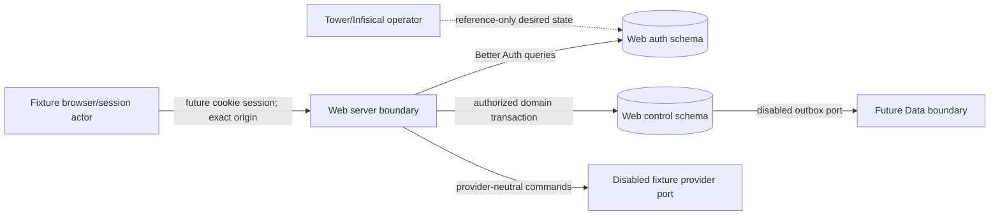

# Developer Control Plane threat model

## Overview

DCP-1A is a server-only, disabled-by-default repository kernel. It configures Better Auth for future database-backed human sessions and organizations, models Web-owned organization/project/key authorization, and orchestrates metadata-only key lifecycle operations behind a provider port. It has no public route, real provider, live database, Data transport, deployment, or production authority.

| Component                         | Purpose                                                                                                          | Evidence                                                                                                                                                                                                                      |
| --------------------------------- | ---------------------------------------------------------------------------------------------------------------- | ----------------------------------------------------------------------------------------------------------------------------------------------------------------------------------------------------------------------------- |
| Better Auth configuration factory | Exact origins, database sessions, organization plugin, secure cookie/session controls, and explicit role mapping | `packages/developer-control-plane/src/auth.ts`                                                                                                                                                                                |
| Control-plane domain              | Organization/project RBAC and metadata-only lifecycle                                                            | `packages/developer-control-plane/src/rbac.ts:15-77`; `packages/developer-control-plane/src/service.ts:125-273`                                                                                                               |
| Provider port and fixture adapter | Isolate unselected key generation/verifier design; accept synthetic caller material only                         | `packages/developer-control-plane/src/fixtures.ts:18-51`                                                                                                                                                                      |
| Transaction boundary              | Commit metadata, audit, and outbox together                                                                      | `packages/developer-control-plane/src/service.ts:277-333`; `packages/developer-control-plane/src/fixtures.ts:88-117`                                                                                                          |
| PostgreSQL migration intent       | Separate Web-owned auth/control schemas and least-privilege roles; generate/validate only                        | `packages/developer-control-plane/migrations/0001_auth_schema.sql:3`; `packages/developer-control-plane/migrations/0002_control_schema.sql:3`; `packages/developer-control-plane/migrations/0003_least_privilege_roles.sql:3` |

No architecture review was delegated because the authorized task forbids subagents; the same focused architecture pass was performed sequentially.

## Threat model, trust boundaries, and assumptions

Protected assets are session integrity, tenant ownership, project authorization, one-time key material, lifecycle state, policy ordering, audit integrity, outbox integrity, database/secret references, and telemetry redaction. A malicious ordinary member may control names, reasons, command IDs, timing, and fixture request inputs, but does not start with another organization's membership, server configuration, database role, provider authority, Tower authority, or secret references.

The browser/server boundary requires a current database session, exact trusted origin, CSRF/origin validation, recent authentication, and explicit organization/project authorization. The server/PostgreSQL boundary requires separate schemas, least-privilege role intent, metadata-only columns, foreign keys, checks, unique constraints, and one transaction for lifecycle/audit/outbox. The server/provider boundary is disabled outside tests and accepts caller-supplied fake material only. The outbox/Data boundary has no transport in DCP-1A; unknown, stale, gap, or mismatched sequence state fails closed. Tower/Infisical is intent-only and uses semantic secret references; no value is resolved or applied. Telemetry accepts allowlisted metric names/states only and no identifiers or secret-bearing material.

Assumptions and open gates: the migration verifier derives the installed Better Auth 1.7.2 `getAuthTables` surface and no route mounts its handler; the future PostgreSQL instance applies the reviewed grants and supplies the required auth-schema search path; the API-key provider and verifier remain unselected; the Data v2 proposal is not accepted or imported; and all provider, database, telemetry, staging, browser, hosted, privacy, and production evidence remains future work.

### Repair controls

Lifecycle validation runs before the repository transaction: command and correlation IDs must match UUIDv7, and reason codes must match the bounded allowlist. Errors are static and redacted, so hostile sentinels cannot be copied into idempotency, audit, outbox, metrics, or serialized errors. Projection sequencing and revocation age accept only finite, safe, non-negative integers; non-finite, negative, fractional, stale, duplicate, gap, rollback, and unknown states fail closed. The migration verifier is generate-only and compares the pinned Better Auth `getAuthTables` model/field surface, defaults, indexes, foreign keys, ID strategy, and configured roles to the reviewed SQL.

## Attack surface, mitigations, and attacker stories

These are hypotheses for focused verification, not confirmed vulnerabilities.

| Priority | Scenario and capability gain                                                                      | Prerequisites                                               | Impact                                               | Existing controls                                                                                   | Required verification/mitigation                                               | Evidence                                                                                                           |
| -------- | ------------------------------------------------------------------------------------------------- | ----------------------------------------------------------- | ---------------------------------------------------- | --------------------------------------------------------------------------------------------------- | ------------------------------------------------------------------------------ | ------------------------------------------------------------------------------------------------------------------ |
| High     | Cross-organization project/key access through an IDOR gains another tenant's lifecycle authority  | Authenticated low-privilege member and guessed UUID         | Key rotation/revocation or metadata disclosure       | Explicit org/project authorization and membership-role matrix                                       | Test every allow/deny edge and ownership mismatch                              | `packages/developer-control-plane/src/rbac.ts:15-77`                                                               |
| High     | Plaintext or session material reaches persistence, audit, outbox, metrics, errors, or retry state | Key create/rotate or malformed request                      | Credential disclosure and replay                     | Metadata-only entities, redacted records, one-time result, duplicate denial                         | Serialize all persisted/error surfaces in negative fixtures                    | `packages/developer-control-plane/src/service.ts:44-65`; `packages/developer-control-plane/src/model.ts:21-134`    |
| High     | Stale or reordered lifecycle state reactivates a revoked key                                      | Duplicate, gap, rollback, delayed delivery                  | Unauthorized machine access                          | Monotonic policy versions, idempotency, immediate revoke precedence, fail-closed sequence validator | Prove duplicate/gap/unknown/stale behavior and 60-second fail-closed threshold | `packages/developer-control-plane/src/service.ts:77-97`; `packages/developer-control-plane/src/retention.ts:10-21` |
| Medium   | Cross-site request performs a privileged mutation                                                 | Cookie-authenticated browser and attacker-controlled origin | Unauthorized lifecycle mutation                      | Exact trusted origins, CSRF/origin checks, recent-auth requirement, host-only cookies               | Typecheck pinned Better Auth controls and keep public handler absent           | `packages/developer-control-plane/src/auth.ts:39-82`; `packages/developer-control-plane/src/rbac.ts:56-77`         |
| Medium   | Database role or migration drift permits secret columns or broad grants                           | Migration/application error                                 | Expanded persistence or unauthorized reads/writes    | Deterministic migration verifier and explicit schema/role intent                                    | Reject secret-like columns, missing constraints, or public grants              | `scripts/developer-control-plane-migrations.ts:1`                                                                  |
| Medium   | Disabled fixture adapter or transport becomes active outside tests                                | Misconfiguration or import misuse                           | Synthetic credentials or unreviewed network behavior | Disabled flags, test-only adapter assertion, disabled transport implementation                      | Verify default env and no network/provider call                                | `packages/developer-control-plane/src/fixtures.ts:18-51`; `packages/developer-control-plane/src/service.ts:68-74`  |
| Low      | High-cardinality identifiers or untrusted reasons leak through telemetry                          | Attacker-controlled names/reasons                           | Privacy/logging exposure and cost                    | Allowlisted names, bounded states, redacted reason codes                                            | Reject identifiers and token-like values in metric tags                        | `packages/developer-control-plane/src/model.ts:121-134`                                                            |

## Severity calibration

- **Critical:** unsupported for DCP-1A without a live/public path; would require demonstrated unauthenticated remote compromise of production identity, provider, or database authority.
- **High:** proven cross-tenant lifecycle authority, plaintext/session disclosure, or revoked-key reactivation once a real provider/consumer is connected.
- **Medium:** privileged browser mutation requiring an authenticated victim, broad database grants before apply, or disabled-fixture activation outside tests.
- **Low:** bounded metadata/telemetry leakage with no credential or tenant authority gain.

No live deployment, provider, database, Data transport, or public route exists in this slice, so deployment-dependent impact remains conditional rather than accepted risk.
